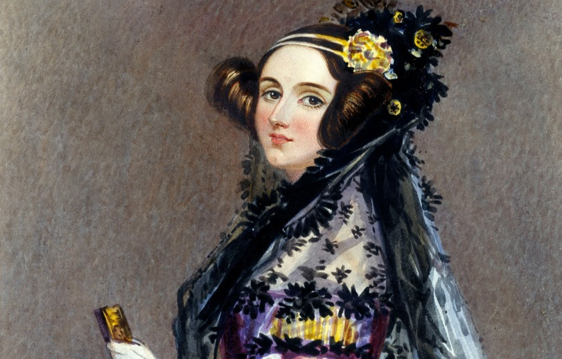
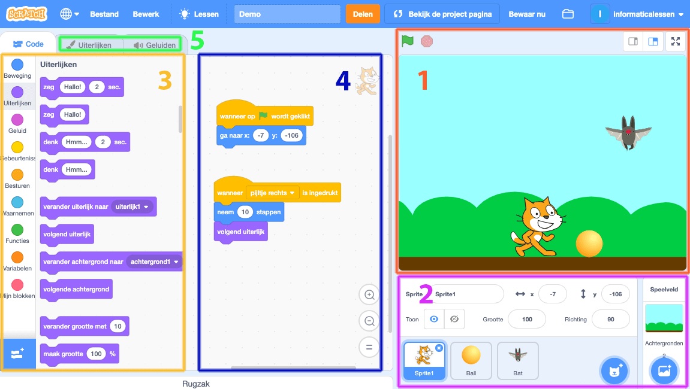
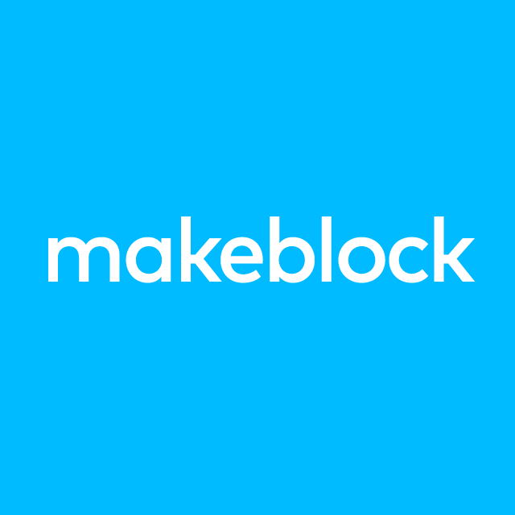
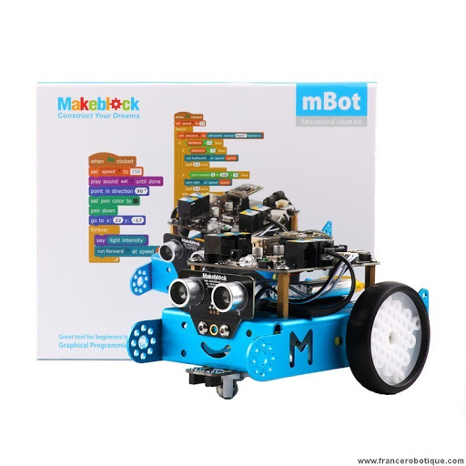
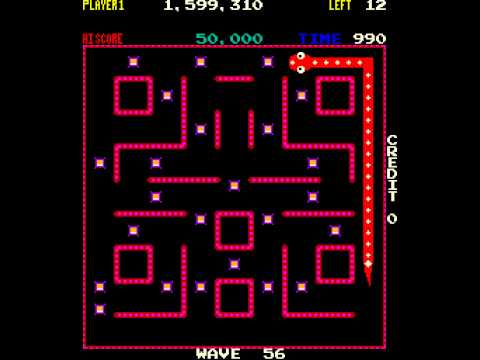
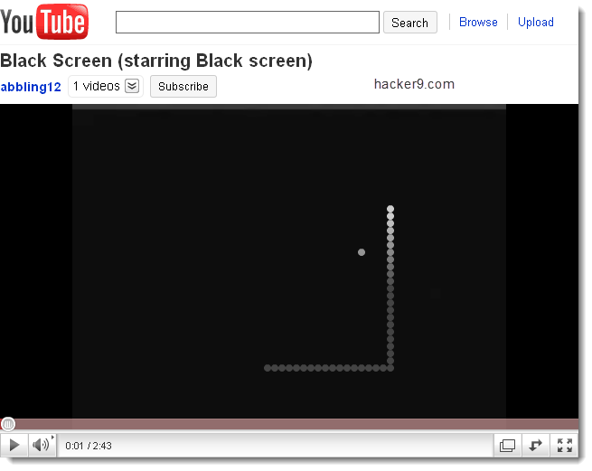
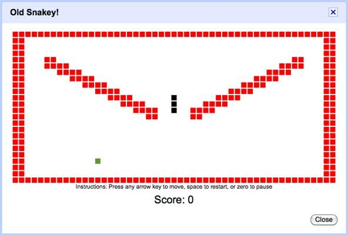
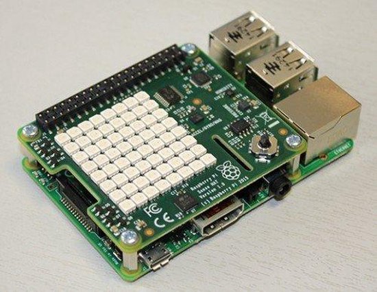

### De eerste computer programmeur

#### Ada Lovelace (1815-1852)

Ada Lovelace wordt ook wel de eerste computerprogrammeur genoemd. Ze schreef namelijk het eerste computerprogramma voor de Analytical Engine (de eerste digitale computer) van Charles Babbage (1791-1871).

De wiskundige werd op 10 december 1815 geboren als Ada Byron. Haar vader is de gekende dichter Lord Byron maar het was haar moeder die haar een echte wisundige maakte. Al op jonge leeftijd kreeg ze les in wiskunde en natuurkunde en in 1835 trouwde ze met de graaf van Lovelace.

In datzelfde jaar leerde Ada Lovelace de uitvinder Charles Babbage  kennen die op dat moment bezig was met de ontwikkeling van zijn analytische machine. De twee hielden contact en enkele jaren later vroeg Babbage aan Lovelace of ze een artikel over de machine wilde vertalen dat in een Frans blad was verschenen. Lovelace deed dit en plaatste er zelf nog veel aantekeningen bij. Die aantekeningen waren zo interessant dat besloten werd die als zelfstandige bijdrage te publiceren.

Lovelace beschreef onder meer een algoritme waarmee de analytische machine zogenaamde Bernouillegetallen kon berekenen omdat deze berekening speciaal voor de computer geschreven werd, wordt dit algoritme ook wel het eerste computerprogramma genoemd.

### Scratch 

Scratch is een object-georiënteerde visuele programmeertaal voor kinderen die ontwikkeld is op de MIT door Lifelong Kindergarten group en het MIT Media Lab. De taal is geschikt voor het maken van visualisaties zoals interactieve verhalen, animaties, spellen, muziek en kunst en richt zich speciaal op jonge mensen vanaf 8 jaar. Zo kunnen kinderen een eerste keer in aanraking komen met programeren op een kind vriendelijke begrijpelijke manier.

Wat kenmerkend is voor deze programeertaal is dat het bestaat uit blokjes code die je in elkaar klikt zoals een puzzel met simpele commando's. Dat beperkt syntaxisfouten door de onderdelen van een programma als legosteentjes in elkaar te laten passen. Als de blokjes passen is het programma syntactisch in orde en kan het worden uitgevoerd. Programmeerfouten blijven vanzelfsprekend mogelijk.

De naam Scratch komt uit de muziek van de dj-techniek scratchen. Het verwijst daarbij naar de mogelijkheid om nieuw werk te maken door werk van anderen te remixen. 

De projectleider van het Scratch-project is Mitch Resnick. Zijn onderzoek stond ook aan de basis voor de ontwikkeling van LEGO Mindstorms, waarbij kinderen robots kunnen bouwen en programmeren.

### Hoe is de mbot ontstaan ? 
De Mbot is ontstaan door het Chinese bedrijf Makeblock. Dit bedrijf staat vooral gekend om het ontwikkelen van Arduino-based hardware,robotics hardware  en Scratch-based software. Hun hoofddoel is om op een zo educatief mogelijke, begrijpelijk  manier programmeren aan te bieden zodat iedereen die robotjes wil programmeren dit eenvoudig kan  leren via hun platform. Zo ontstond ook de Mbot.

### Mbot programmeren - robotica 
Het platform dat je gebruikt om de Mbot te programmeren is Makeblock. Via eenvoudige commandos kan je de Mbot makkelijk programeren. Dit zijn plat uitgedrukt blokjes die je in elkaar puzzelt.

### Uitvinder van de snake game
De eerste Snake game is gemaakt en gepubliceerd door Gremling in 1976. Dit was in de vorm van een arcade game. 

De eerte Snake game op de computer was in 1978 door Peter Trefonas en gepubliceerd door CLOAD magazine in hetzelfde jaar.

Zo werden er steeds meer clonen en versies gemaakt van de snake game. 

Vroeger kon je de snake game overal spelen. 

In 2010 kwam Youtube met een easter egg af. De snake game verborgen in de videos. Als je Youtube opende in Mozilla firefox of  Operah en tijdens dat je video op pauze stond, klikte je op het pijltje naar links de hele tijd ,zo kon je de snake game versie van youtube spelen.
Vandaag de dag werkt deze helaas niet meer. De game zag er zo uit als op de foto.

Mobiel werd deze ook gepubliceerd op de eerste gsm die we hadden.

Zelf op je Gmail kon  je deze game spelen.
Snake op Gmail genaamd 'Ol Snakey' kan worden gespeeld binnen Gmail. Dit vereist de toegang tot Labs, het inschakelen van sneltoetsen, en vervolgens het activeren van de app. Zodra het beschikbaar is, wordt het gespeeld door het indrukken van het &- teken in het hoofd-Gmailvenster.

In 2017 had zelf Google zijn eigen snake game deze kan je vinden als je snake game Google in typt en je kan  deze dan ook spelen. Wat heel weinig mensen weten is dat Google heel wat verborgen games heeft die je kan spelen. De video hier onder vertel je hoe je de verborgen games van Google kan spelen. Deze games zijn verborgen als een soort easter egg.

<iframe width="750" height="350" src="https://www.youtube.com/embed/k3XIBkdAqes" frameborder="0" allow="accelerometer; autoplay; clipboard-write; encrypted-media; gyroscope; picture-in-picture" allowfullscreen></iframe>

### Javascript
Javascript werd in 1995 ontwikkeld door Brendan Eich van Netscape Communications Coporation voor te gebruiken in Netscape Navigator. Vroeger kreeg Javascript de naam Mocha of ook wel de naam Livescript. De taal werd hernoemd tot Javascript in de tijd dat in de Netscape-browser ook ondersteuning  voor Java-applets werd ingebouwd.

Met de introductie van JavaScript ontstonden de eerste mogelijkheden om webpagina's interactief te maken. Dit werd later Dynamic HTML genoemd.

Microsoft heeft dan weer een eigen implementatie van JavaScript ontwikkeld onder de naam JScript en Adobe heeft een eigen versie genaamd ActionScript die gebruikt wordt in Flash.

De  laaste jaren evolueert de taal constant. Er komen steeds nieuwe functionaliteiten bij die ons het programmeren soms zelf nog makkelijker maken. 

### Raspberry pi 

De Raspberry pi is een singleboard computer dat bedoelt was voor educatieve doeleinden. Het hoofddoel was kinderen kennis te laten maken met programmeren op eenvoudige wijze, zonder dat grote kosten zouden moeten worden gemaakt.

####  Een sprong in de geschiedenis van de pi
De eerste concepten van de raspberry pi ontstonden in 2006 en deze waren gebaseerd op de Atmel Atmega644-microcontroller. De stichter van de Raspberry Pi Foundation , Ebben Upton die werkzaam is in de computerindustrie overtuigde een groep academici en anderen personen  om enthousiast mee te werken aan het project. Het hoofddoel van het project was om kinderen kennis te laten maken met programmeren op eenvoudige wijze zonder dat ze hier te grote koten moesten voor maken.

In augustus 2011 kwam de eerste alfaversie van de raspberry pi uit. Dit waren vooral test objecten en nog niet terbeschikking voor de consument. 

Eind 2011 gingen ze al naar een betaversie. Deze testen ze ook uit ook de consument kon deze al kopen als test zodat de effectieve lancering voor februari 2012 een feit was.

Op 14 juli 2014 werd een verbeterde versie van de Raspberry Pi model B geïntroduceerd: model B+. Deze kost evenveel als model B, die in productie zal blijven zolang er vraag is. Model B+ heeft verbeteringen ten opzichte van model B, zoals 40 pinnen op de GPIO-aansluiting in plaats van 26, 4 USB poorten in plaats van 2, een microSD slot, betere audio en een lager energieverbruik.[10]

Op 26 november 2015 werd de Raspberry Pi Zero aangekondigd: een computer die slechts 5 dollar kost. Deze heeft een Broadcom BCM2835 application processor met 1 GHz ARM11 core (40% sneller dan de Raspberry Pi 1), 512MB LPDDR2 SDRAM, een micro-SD slot, een mini-HDMI aansluiting met 1080p60 video output, twee micro-USB aansluitingen voor data en voeding, een 40-pin GPIO-aansluiting zonder de pinnen (lay-out identiek aan Model A+/B+/2B) en een composiet video aansluiting zonder de connector. De pinnen en de connector kunnen er desgewenst later zelf op gesoldeerd worden. Het formaat bedraagt 65mm x 30mm x 5mm, de kleinste Raspberry Pi ooit.[1

Zo kwamen er steeds andere versies op de raspberry pi markt. Deze dag is de laaste versie de raspberry pi 4.

### Bronnenlijst
Ada Lovelace. (z.d.). [Illustratie]. Ada Lovelace. https://historiek.net/wp-content/uploads-phistor1/2012/12/Ada-Lovelace-1815-1852-De-eerste-computerprogrammeur.jpg

Gmail Snake Game. (z.d.). [Foto]. Gmail. https://www.google.com/url?sa=i&url=https%3A%2F%2Fsocial-games.wonderhowto.com%2Fhow-to%2Fplay-snake-game-online-youtube-gmail-facebook-0122937%2F&psig=AOvVaw2_G7_pXe8wrf38btMH2WKf&ust=1603012372492000&source=images&cd=vfe&ved=0CAIQjRxqFwoTCLC45Muku-wCFQAAAAAdAAAAABAD

Historiek. (2019, 2 december). Ada Lovelace (1815-1852) – De eerste computerprogrammeur. https://historiek.net/ada-lovelace-eerste-computerprogrammeur/19745/

Javascript. (z.d.). [Illustratie]. Javascript. https://www.google.com/url?sa=i&url=https%3A%2F%2Fdatavisioner.net%2Fjavascript-basics-js-note-1%2F&psig=AOvVaw2XK8LJFcGDCD3mK_baQJr0&ust=1603011678893000&source=images&cd=vfe&ved=0CAIQjRxqFwoTCPiZ8Yiiu-wCFQAAAAAdAAAAABAJ

Makeblock Logo. (z.d.). [Illustratie]. Makeblock. https://www.google.com/url?sa=i&url=https%3A%2F%2Fen.wikipedia.org%2Fwiki%2FMakeblock&psig=AOvVaw2Ls1oxqRaPMJWlzC2HKJlY&ust=1603012003945000&source=images&cd=vfe&ved=0CAIQjRxqFwoTCLCcuZqju-wCFQAAAAAdAAAAABAF

mbot robot starter kit. (z.d.). [Foto]. mbot. https://www.google.com/url?sa=i&url=https%3A%2F%2Froboshop.lv%2Froboti%2Fmakeblock-mbot-robots-konstruktors-2-4g-versija%2F&psig=AOvVaw2Ls1oxqRaPMJWlzC2HKJlY&ust=1603012003945000&source=images&cd=vfe&ved=0CAIQjRxqFwoTCLCcuZqju-wCFQAAAAAdAAAAABAL

Old Classic Retro Games. (2015, 15 maart). YouTube [Video]. YouTube. https://www.google.com/url?sa=i&url=https%3A%2F%2Fwww.youtube.com%2Fwatch%3Fv%3DYTFOwqZcEP4&psig=AOvVaw3dwupYqDADn9oeYP0CK4VH&ust=1603012217758000&source=images&cd=vfe&ved=0CAIQjRxqFwoTCJjbwoCku-wCFQAAAAAdAAAAABAD

Peter Trefanos. (z.d.). [Foto]. Peter Trefanos. https://www.google.com/url?sa=i&url=https%3A%2F%2Fwww.dupont.com%2Felectronic-materials%2Fnews%2F2018%2Fpressreleases%2F20180222.html&psig=AOvVaw0TXbwt3motg48-7wDZ2g5x&ust=1603012282664000&source=images&cd=vfe&ved=0CAIQjRxqFwoTCOi-xKCku-wCFQAAAAAdAAAAABAD

raspberry pi + sensehat. (z.d.). [Foto]. Raspberry pi. https://media.s-bol.com/NkDlxnD2Dkoz/550x426.jpg

Scratch. (z.d.). [Foto]. Scratch. https://www.google.com/url?sa=i&url=https%3A%2F%2Finformaticalessen.be%2Fprogrammeren%2Fkennismaking-met-scratch%2Fscratch-omgeving%2F&psig=AOvVaw0pb5UNlTLC2Ik4VorFIgPE&ust=1603012095298000&source=images&cd=vfe&ved=0CAIQjRxqFwoTCIiB8ciju-wCFQAAAAAdAAAAABAD

Scratch (programmeertaal). (2020, 18 oktober). In Wikipedia. https://nl.wikipedia.org/wiki/Scratch_(programmeertaal)Snake (computerspel). (2020, 18 oktober). In Wikipedia. https://nl.wikipedia.org/wiki/Snake_(computerspel)Snake (video game genre). (2020, 18 oktober). In Wikipedia. https://en.wikipedia.org/wiki/Snake_(video_game_genre)

Youtube Snake Game. (z.d.). [Foto]. Youtube. https://www.google.com/url?sa=i&url=https%3A%2F%2Fhackyshacky.com%2Fblog%2Fsnake-game-on-youtube%2F&psig=AOvVaw03q2GjBzqojRhi7qekVOmQ&ust=1603012342941000&source=images&cd=vfe&ved=0CAIQjRxqFwoTCNC058Cku-wCFQAAAAAdAAAAABAD

