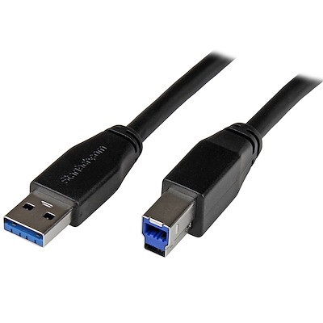

### Wat is een mbot ?
<iframe width="560" height="315" src="https://www.youtube.com/embed/pmsSipper3Y" frameborder="0" allow="accelerometer; autoplay; clipboard-write; encrypted-media; gyroscope; picture-in-picture" allowfullscreen></iframe>

###  benodigheden
<ul>
<li>Mbot starters robot kit</li>
<li>USB-B kabel(zoals bij  een oud fototoestel)</li>
<li>Programma Makeblock</li>
</ul>

### het in elkaar steken van de mbot
De uitdaging is vrij blijvend aan jullie. Ik raad het aan zelf wel eerst te proberen en dan pas naar de video te kijken als het niet zelf lukt is er een helpende instructie video hieronder. 

<iframe width="560" height="315" src="https://www.youtube.com/embed/L_4vNkVtqb8" frameborder="0" allow="accelerometer; autoplay; clipboard-write; encrypted-media; gyroscope; picture-in-picture" allowfullscreen></iframe>

### mbot connecteren 
Stap 1: Download Makeblock

Stap 2: Open Makeblock en ga naar devices

Stap 3: Voeg de mbot toe

stap 4: Steek de USB-B kabel in de Mbot en de andere USB kabel in je computer

Stap 5: Zet de mbot aan

Stap 6: Duw op connect,je ziet nu een link verschijnen klik dan op connect

Je mbot is nu gekoppeld

### mbot laten bewegen 
Dus hoe kan je deze mbot nu effectief laten bewegen van voor naar achter ? 

Nu je mbot gekoppeld is kunnen we beginnen met de mbot te programmeren

<iframe width="560" height="315" src="https://www.youtube.com/embed/-RFeI0YjC0U" frameborder="0" allow="accelerometer; autoplay; clipboard-write; encrypted-media; gyroscope; picture-in-picture" allowfullscreen></iframe>

### mbot muziek laten maken 

### mbot laten dansen

