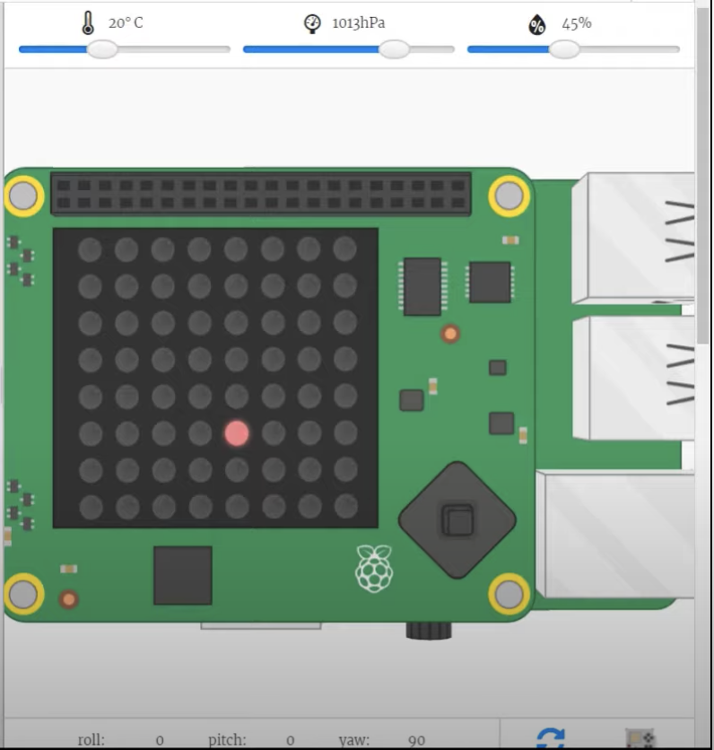
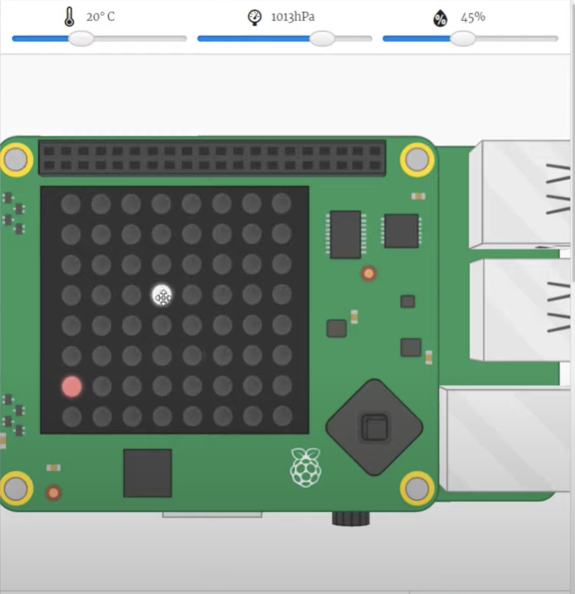

# Snake game op de raspberry pi

### Benodigheden
<uL>
<li>Raspberry pi (3) of (4)</li>
<li>Sensehat op de raspberry pi</li>
<li>Programmeer taal Python</li>
</uL>

### Programmeren van de snake game op de raspberry pi

Stap 1: Koppel je raspberry pi aan een extern scherm + toetsenbord + muis

Stap 2: Open je Thonypython app

Stap 3: importeer alle modules zoals Sensehat, time en random

```py
import time, random
from sense_hat import SenseHat
```

Stap 4: Defineer je sensehat
```py 
s = SenseHat()
```
Stap 5: Defineer alle kleuren(rgb-waarden) + de snake array + de begin richting van de slang 
```py 
red = (255, 0,0)
green = (0,255,0)
clear =(0,0,0)

snake = [[3,3]]
direction = [1,0]
length = 1

```

Stap 6: Zorg dat het appel object altijd op een andere positie terrecht komt
```py
applePos=[random.randint(0,7), random.randint(0,7)]
```

Stap 7: Defineer de rest van het veld
```py 
pixels = [clear] * 64 
```

Stap 8: Defineer de rest van het veld
```py 
pixels = [clear] * 64 
```
Nu gaan we ons appel object effectief gaan displayen op onze raspberry pi

Stap 9: Laat de appel verschijnen op je raspberry pi en zorg dat alles in de juiste dimensie staat
```py 
while True:
	pixels = [clear] * 64 
	#y * rowsize + x = color
	pixels[applePos[1] * 8 + applePos[0]] = red
	
	s.set_pixels(pixels)
	
	time.sleep(0.15)
```
Normaal als alles goed staat krijg je dit op je raspberry pi 


Stap 10: Nu gaan we onze snake zelf gaan displayen dit doen we aan de hand van een for loop
```py 
for pos in snake:
    pixels[pos[1] * 8 + pos[0]] = green
```

Als alles juist staat krijg je nu de snake te zien als een groen bolletje op je raspberry pi.


Stap 11: Nu maken we buiten onze While true een een functie direction aan en defineren we de richting van de slang aan de hand van arrays. ( Dit is fout in het filmpje maar wordt gecorrigeerd op het einde
```py
def setDirection(d): #0 = 'up', 1 ='right', 2 = 'down', 3 ='left'

  global direction
  
  if d == 0:
    direction = [0, -1]
  elif d == 1:
    direction = [1,0]
  elif d == 2:
    direction = [0,1]
  elif d == 3:
    direction = [-1,0]
```
Stap 12: Spreek je event joystick aan in je while true loop doe ook even een test door je event te printen
```py
for event in s.stick.get_events():
    # print(event.direction, event.action)
```
Stap 13: Defineer nu if else statements in je event functie aan de hand van commando's om de richting te bepalen roep  ook zeker je direction functie aan.
```py
for event in s.stick.get_events():
    # print(event.direction, event.action)
	if event.action == 'pressed':
      
      if event.direction == 'up':
        setDirection(0)
      elif event.direction == 'right':
        setDirection(1)
      elif event.direction == 'down':
        setDirection(2)
      elif event.direction == 'left':
        setDirection(3)
```

Stap 14: Zet dit commando op dezelfde tab als je for loop zodat deze buiten de if else statements komt. Dit commando wordt duidelijker uitgelegd in onderstaande video waar u de tutorial kan volgen.
```py 
 snake.insert(0, [snake[0][0] + direction[0], snake[0][1] + direction[1]])
```
Nu gaan we kijken hoe we het kunnen regelen dat onze snake de appel op eet. Dit coderen we als volgt.

Stap 15: Vergelijk de positie van de snake en de appel en zorg dat als de snake en de appel dezelfde positie hebben de appel ergens anders wordt gedisplayed.
```py
if snake[0] == applePos:
    applePos= []
    while applePos == []:
      applePos = [random.randint(0,7), random.randint(0,7)] 
```

Stap 16: Zorg er nu voor dat de nieuwe positie van de appel niet op een snake lichaampje terrecht komt.
```py
 if applePos in snake:
        applePos=[]
    length += 1
```

Stap 17: Zorg dat de lengte van de slang gelijk is aan zijn werkelijke lengte dit defineren we in een else statement van de eerste if statement waar de onze appel positie vergelijken met die van de snake.
```py
  else:
    while len(snake) > length:
      snake.pop()
```
Maar wat als onze snake tegen zichzelf botst?
Dan moeten we zorgen dat het spel automatisch opnieuw begint. 

Stap 18: Zorg aan de hand van een elif dat we er voor zorgen dat de lengte van de snake weer 1 is als deze tegen zichzelf botst. 
```py
 elif snake[0] in snake[1:]: #reset length if snake runs into itself
      length = 1
```
Dit is niet zomaar de snake game doordat ons veld veel kleiner is op de raspberry pi zouden we er voor  zorgen dat onze slang bij botsing met de rand automatisch aan de andere kant zit en zo doorgaat. Deze speciale variant op de snake game programmeren we als volgt.

Stap 19: Zorg er voor dat als de snake de rand raakt deze automatisch aan de overkant gedsiplayed is aan de hand van if else statements 
```py 
 if snake[0][0] < 0:
    snake[0][0] = 7
  if snake[0][1] < 0:
    snake[0][1] = 7
  if snake[0][0] > 7:
    snake[0][0] = 0
  if snake[0][1] > 7:
    snake[0][1] = 0
```
Een specifieke uitleg waarom bepaalde delen zo worden geprogrammerd, vinden jullie in onderstaande video. Dus moest het nog niet meteen lukken er is ook een video om alles goed te begrijpen en zeker er voor te zorgen dat de positie van de bepaalde delen code juist is;-).

### instructie video snake game raspberry pi
<iframe width="730" height="400" src="https://www.youtube.com/embed/ZdnAF4OHwmM" frameborder="0" allow="accelerometer; autoplay; clipboard-write; encrypted-media; gyroscope; picture-in-picture" allowfullscreen></iframe>